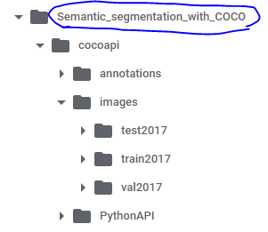

# Manipulate-COCO-dataset
Explore COCO dataset and manipulate elements in the context of semantic segmentation

This notebook explores the COCO (Common Objects in Context) image dataset and can provide helpers functions for Semantic Image Segmentation in Python. It uses the initial tools and approach described in two publications from Viraf Patrawala. For the originals, you can visit his github repo [here](https://github.com/virafpatrawala/COCO-Semantic-Segmentation).

“COCO is a large-scale object detection, segmentation, and captioning dataset.”

COCO provides multi-object labeling, segmentation mask annotations, image captioning, key-point detection and panoptic segmentation annotations with a total of 81 categories, making it a very versatile and multi-purpose dataset.

COCO 2017 dataset comes with nearly 120.000 training images, each with at least 5 captions, pixelwise semantic segmentation, keypoints... as well as 40.670 test images and 5000 validation images.

Visit  for more information on COCO, including for the data, paper, and tutorials. I recommend checking for the exact format of the annotations described on the COCO website [here](https://cocodataset.org/#format-data).

## Requirements
- download COCO API from [here](https://github.com/cocodataset/cocoapi). This package provides Matlab, Python, and Lua APIs that assists in loading, parsing, and visualizing the annotations in COCO. Select yours and replicate the speficic API folder into your working folder.
- download COCO dataset from [here](https://cocodataset.org/#download). I used the 2017 train/Val/test image sets as well as 2017 Train/Val annotations in this notebook. A lighter alternative exists with the 2014. Beware that the dataset is extremely large (over 24Gb of data).

## Folder structure
I used this folder structure which you can eventually replicate. My working drive where to put the notebook is the top folder.

